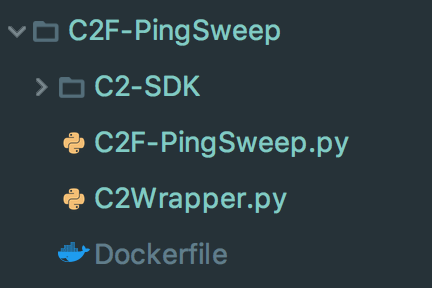
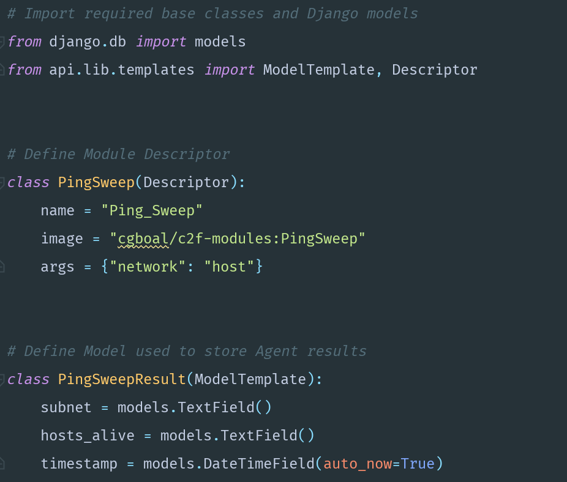
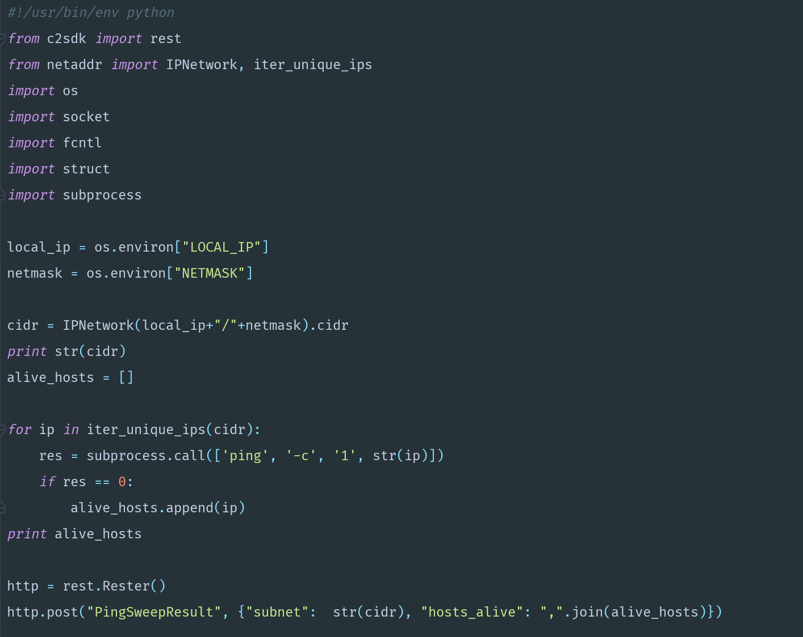
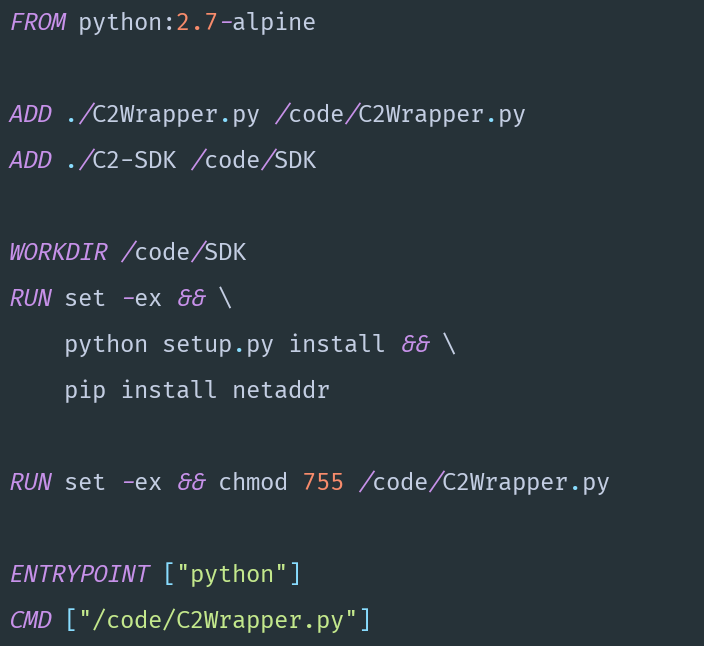

# Example Module

### Introduction

The below screenshots detail the files required to create a module which performs a ping sweep of the Agents local network, and reports the results to the Master Node. Hopefully, through reviewing this example it will be evident how little overhead there is when converting a normal Dockerized application to function within C2F. 

### Module Structure

### Module File

Below is the Module File as described in the C2F Module Files chapter, which would be uploaded to the web interface to assimilate the Module into C2F.

### C2F-Wrapper.py

This file is the script which will be put inside the Docker container to perform the ping sweep, and report the data. 


Note: The entire module functionality need not be implemented in Python. For example, the container could run a Nmap scan and output the results to a file. In this instance, the wrapper would parse the output files and send the data to the data using the c2sdk module.


### Dockerfile

Below is the Dockerfile used to generate the PingSweep module.

